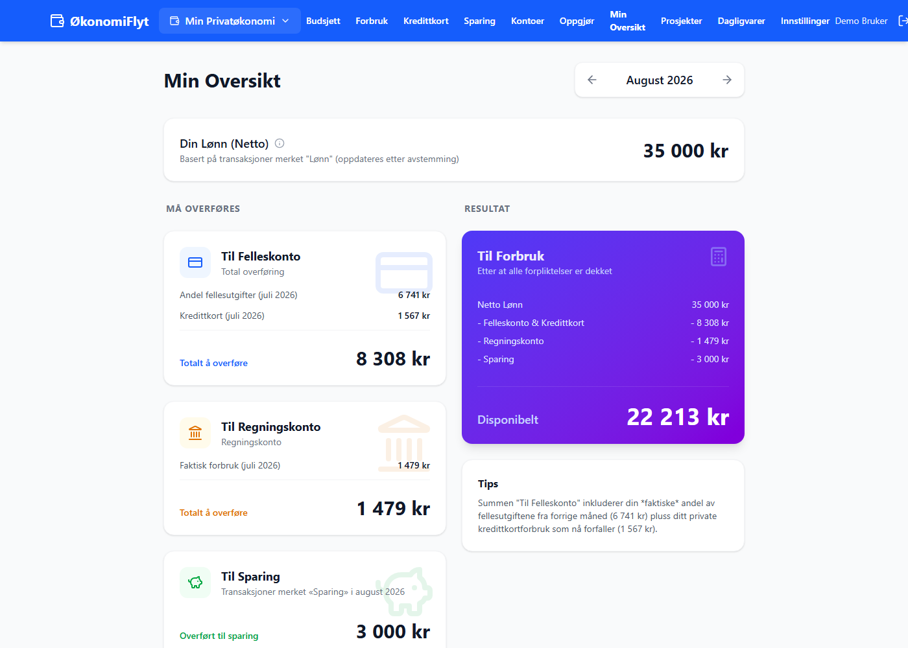
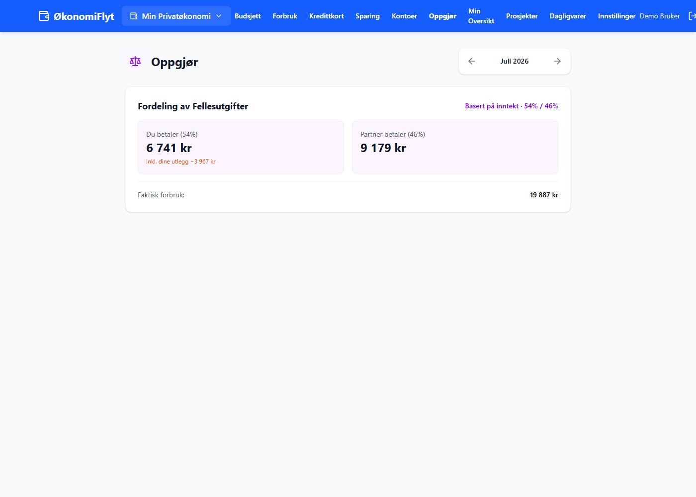
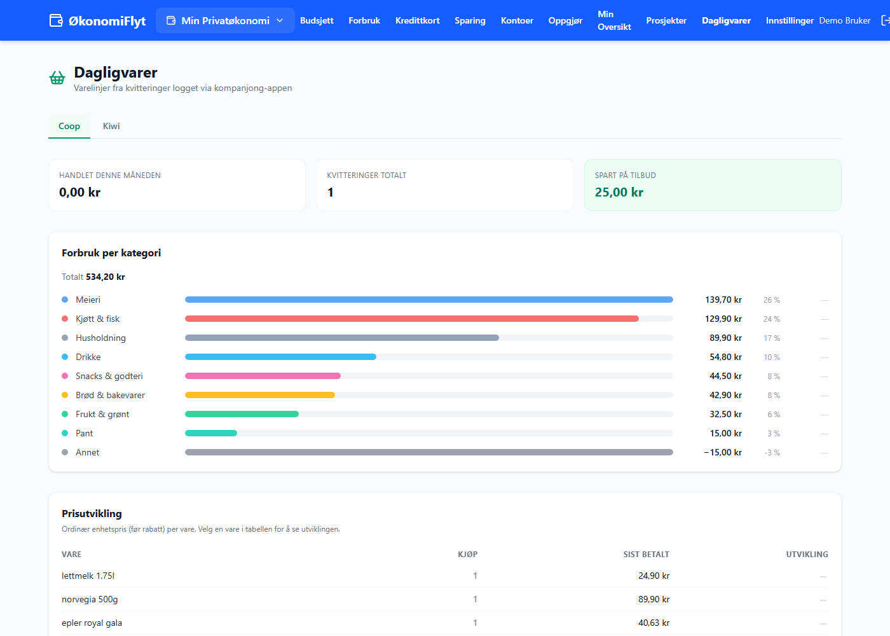
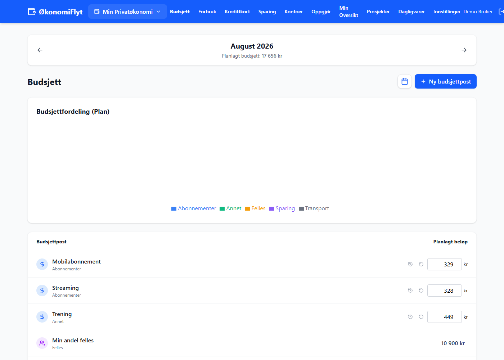

# ØkonomiFlyt

Privatøkonomi-app for husholdninger med delt og personlig økonomi. Bygget for
reell månedlig bruk: budsjettene avstemmes mot faktiske banktransaksjoner, og
etter avstemming skal tallene være eksakte.

Prosjektet består av tre deler:

| Del | Teknologi | Hva den gjør |
|---|---|---|
| [Webapp](src/) | React 19, Vite, Tailwind, Firebase | Budsjett, transaksjoner, avstemming, prosjekter, innsikt |
| [Companion-app](companion_app/) | Android (Kotlin, Jetpack Compose) | Kvitteringsfangst: deler kvittering inn i appen, Claude tolker varelinjene, geofence-varsel etter butikkbesøk |
| [sb1-sync](sb1-sync/) | Node.js, Docker | Henter transaksjoner automatisk fra SpareBank 1 sitt API (OAuth/BankID) og lander dem i Firestore |

## Funksjoner

- **Flere budsjetter** – personlig og delt husholdningsbudsjett med
  inntektsvektet fordeling mellom medlemmer
- **Transaksjonsimport** – CSV-eksport fra bank eller automatisk via
  SpareBank 1-API, med duplikatdeteksjon og sammenslåing
- **Avstemming** – transaksjoner kobles mot budsjettposter måned for måned;
  en avstemt måned er fasit
- **Kvitteringer på varelinjenivå** – companion-appen tolker kvitteringer med
  Claude og matcher dem automatisk mot transaksjoner på beløp + dato
- **Matvareinnsikt** – varelinjer kategoriseres og aggregeres per kjede
- **Prosjekter** – øremerkede utgifter (oppussing, ferie) på tvers av budsjetter
- **Refusjoner og utlegg** – retur/utlegg håndteres eksplisitt i oppgjøret

## Skjermbilder (demo-modus)

**Min Oversikt** – hva som må overføres hvor etter forrige måneds forbruk:



**Oppgjør** – inntektsvektet fordeling av fellesutgifter, med utlegg trukket fra:



**Dagligvarer** – varelinjer fra kvitteringer, kategorisert og med prishistorikk per vare:



**Budsjett** – planlagte poster per måned:



## Kom i gang

```bash
npm install
npm run dev
```

Uten videre oppsett starter appen i **demo-modus** med et syntetisk datasett i
minnet – ingen Firebase-konto eller innlogging kreves. Alt du gjør i demoen
lever kun i nettleserfanen.

En eksempel-CSV for importfunksjonen ligger i [demo/](demo/).

### Kjøre mot egen Firebase

1. Opprett et Firebase-prosjekt med Firestore og Google-innlogging aktivert
2. Kopier `.env.example` til `.env` og fyll inn web-konfigen fra
   Firebase Console
3. `npm run dev`

Demo-modus kan også tvinges på med `VITE_DEMO_MODE=true` i `.env`.

### Companion-app og sb1-sync

Android-appen bygges i Android Studio og trenger din egen
`google-services.json` (genereres av Firebase Console) samt tre verdier i
`local.properties`: `ANTHROPIC_API_KEY` for kvitteringstolkningen og
`COMPANION_AUTH_EMAIL`/`COMPANION_AUTH_PASSWORD` for en dedikert
Firebase-enhetskonto (Firestore-reglene i [firestore.rules](firestore.rules)
slipper kun kjente bruker-ID-er til).
Synk-tjenesten er dokumentert i [sb1-sync/README.md](sb1-sync/README.md).

## Arkitektur i korte trekk

- All datatilgang i webappen går gjennom et tynt API-lag i
  [src/services/firebase.js](src/services/firebase.js); demo-modus bytter ut
  laget med en in-memory-implementasjon mot
  [src/services/demoData.js](src/services/demoData.js)
- [BudgetContext](src/contexts/BudgetContext.jsx) eier all tilstand for aktivt
  budsjett (kontoer, transaksjoner, budsjettposter, kvitteringer)
- Budsjettposter er delt i *definisjoner* (gjenbrukbart bibliotek) og
  *instanser* per budsjett med månedlige overstyringer
- sb1-sync er eneste komponent som kjenner bankens feltnavn; alt normaliseres
  før det lander i Firestore
